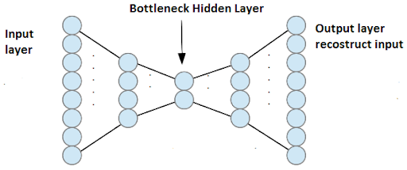

# Missing value Imputation (MVI)

1. Single Imputation techniques

   * Mean Substitution
     * Replace missing values on a variable with the mean value of the observed values
   * Median Substitution
     * This method is slightly improved by first stratifiying the data into subgroups and using subgroup average
   * Standard Substitution
     * It is useful in comparing sets of data which may have the same mean but a different range

2. Markov or Gibbs processes

   > When external knowledge is available about the dependencies between the missing values as well as about the dependencies between missing and observed data

* the autoregressive integrated moving-average (ARIMA) method
* the Markov Chain Monte Carlo (MCMC) multiple imputation method
* K-NN
* denoising autoencoder (DAE)

## Missing Data

1. missing completely at random (MCAR)
   * missing occurs entirely at random
2. missing at random (MAR)
   * missing depends only on the observed variables
3. not missing at random (NMAR)
   * missing depends on both observed variables and the unobserved variables

## Concepts

### AutoEncoder (AE)

> Unsupervised learning
>
> 참고 : https://blog.naver.com/laonple/220880813236

* 보통 hidden layer의 뉴런 개수가 입력보다 작기 때문에 input layer에서 hidden layer로 넘어가는 과정은 Encoding 이 필요하며, hidden layer에서 output layer로 넘어가는 과정은 Deconding 과정이 필요
  * 이런 차원을 줄이는 과정 때문에 AE의 주요 응용 분야 중 하나가 Dimensionality reduction
  * 만약, hidden layer의 뉴런 개수가 입력보다 크다면?
    * identity 함수를 구현하는 것이 너무 쉬워짐, 연결하고 남는 것들의 파라미터를 0으로 설정하면 됨
* AE는 입력보다 작은 차원을 갖는 hidden layer를 이용해 입력 데이터 속에 숨어 있는 변수(latent variable)들을 발굴 할 수 있게 함
  * PCA는 선형적인 한계가 있는 반면, AE는 뉴런이 가지고 있는 non-linearity 성질 및 가해주는 constraints로 인해 훨씬 뛰어난 차원 축소 능력을 지니고 있음
* Output layer는 Unsupervised learning에서 출력을 입력에 근사 시키기 위한 용도로 필요했기 때문에 (학습 도우미 역할) 학습을 마치고 나면 의미가 있는 hidden layer만 남기고 output layer는 버림

### Stacked AutoEncoder

> hidden layer가 여러 개 쌓인 AE

* 각각의 hidden layer는 앞 단에서 얻은 feature를 더 compact 하게 표현한다고 볼 수 있음, 이를 위해 차원을 계속 줄여가므로 위 그림과 같은 형태가 나타나게 됨

### Denoising AutoEncoder (DAE)

> 잡음을 제거할 수 있는 AE - 복원 능력을 강화하기 위해 기본 AE의 학습 방법을 확장 시킨 것
>
> 원래 AE는 unsupervised learning을 이용하여 입력 데이터에 숨어 있는 특징(feature)을 파악하는 용도로 개발이 되었으며, 딥러닝 기술들이 발표되기 전까지는 pre-training 용도로 많이 사용 됨
>
> 참고 : https://blog.naver.com/laonple/220891144201

* 원래의 row input data에 noise를 가하여 destucted input data를 새로 만들어서 이를 input으로 설정하여 output이 원래의 row input data에 가까워지도록 학습하여 noise에 대해 robust 해지도록 함

### Sparse AutoEncoder

#### Sparse coding?

> 전체 데이터를 대표할 수 있는 몇개의 작은 활성화된 코드만을 이용하여 원래의 신호를 복원
>
> AE 역시 encoding 단계에서 입력보다 더 작은 유닛으로 표현하는 과정을 거치기 때문에, Sparse Coding과 비슷함
>
> AE는 sparsity를 강제하기 위한 panelty 항목이 없고 reconstruction error만 확인한다는 차이가 있지만 AE는 hidden unit의 수를 입력보다 작게 함으로써 결과적으로 compact coding의 효과를 얻을 수 있다는 점이 비슷함

* Sparse AE 는 sparse coding 과 AE의 장점을 결합한 방식
* 기본적인 AE 처럼 reconstuction error에 기반한 weight matrix W를 구하는 것이 아니라 여기에 sparsity 조건을 강제함으로써 hidden unit에 존재하는 뉴런의 활성화를 제한 하는 AE

#### K-Sparse AutoEncoder

## Paper Review

#### A Deep Learning Based Approach for Traffic Data Imputation

* denoising stacked autoencoder (DSAE)

  * denoising autoencoder (DAE) + stacked autoencoders (SAE)
  * traffic data imputation을 위해 DAE 기반으로 한 DSAE를 사용
  * 일정 기간, 한 센서로 부터 일정 시간 간격으로 수집된 2D 데이터를 사용
  * 그냥 NN을 사용한 것 보다 정확도가 높게 측정되어 어느 정도 성능 개선이 있었음

  > DAE : 
  >
  > P.Vincent,H.Larochelle,Y.Bengioetal.,”Extracting and composing robust features with denoising autoencoders.” in Proceedings of the 25th International Conference on Machine Learning, Helsinki, Finland, pp. 1096-1103, 2008.
  >
  > Stacked AE optimization method :
  >
  > Y. Bengio, P. Lamblin, D. Popovici et al., Greedy layer-wise training of deep networks, Advances in neural information processing systems, vol. 19, pp. 153, 2007. -> 요즘 잘 안 쓰이는 방법
  >
  > 참고 : https://m.blog.naver.com/PostView.nhn?blogId=laonple&logNo=220884698923&proxyReferer=https:%2F%2Fwww.google.com%2F

---

#### Extracting and Composing Robust Features with Denoising Autoencoders

---

#### GAIN: Missing Data Imputation using Generative Adversarial Nets

* GAN?

  > 비지도 학습으로 원 데이터가 가지고 있는 확률분포를 추정하도록 하고, 인공신경망이 그 분포를 만들어 낼 수 있도록 하는 것
  >
  > 참고 : https://www.samsungsds.com/kr/insights/Generative-adversarial-network-AI.html

  * GAN에서 다루고자 하는 모든 데이터는 확률분포를 가지고 있는 랜덤변수(Random Variable)

    * 랜덤변수는 측정할 때마다 특정 확률분포를 따르는 다른 숫자가 나올 수 있는 값
    * 즉, 랜던변수의 확률 분포를 안다는 것은 데이터에 대한 전부를 이해하는 것

  *  GAN과 같은 비지도학습이 가능한 머신러닝 알고리즘으로 데이터에 대한 확률분포를 모델링 할 수 있으면, 원 데이터와 확률분포를 공유하는 무한히 많은 새로운 데이터 생성 가능

  * Ian Goodfellow 가 발표환 GAN은 회귀생성 모델로서 분류를 담당하는 모델(Discriminator D) 과 회귀를 생성하는 모델(생성자 G)로 구성

    * 생성자 G와 판별자 D가 서로의 성능을 개선하며 적대적으로 경쟁해 나가는 모델
      * 생성자 G는 원 데이터의 확률분포를 알아내려고 노력하며, 학습이 종료된 후에는 원 데이터의 확률분포를 따르는 새로운 데이터 생성
    * GAN이 만들어 내는 확률분포와 원데이터의 확률분포가 거의 동일하게 되면 분류자 D는 0.5 라는 확률 값을 내놓음
      * 동전을 던져서 앞면,뒷면의 확률이 똑같이 0.5 가 되는 것처럼 GAN에 의해 만들어진 데이터가 진짜인지 가짜인지 맞출 확률이 0.5가 되면서 분류자가 의미가 없어지게 됨
        * 즉 G가 실제 데이터와 거의 유사한 데이터를 생성하고 있다는 뜻

  * 적대적 학습은 분류 모델을 먼저 학습시킨 후, 생성 모델을 학습시키는 과정을 반복

  * 분류 모델 D의 학습

    1. 진짜 데이터를 입력해서 네트워크가 해당 데이터를 진짜로 분류하도록 학습
    2. 생성 모델에서 생성한 가짜 데이터를 입력해서 해당 데이터를 가짜로 분류하도록 학습

  * 생성 모델 G의 학습

    1. 생성 모델에서 만들어낸 가짜 데이터를 판별 모델에 입력하고, 가짜 데이터를 진짜라고 분류할 만큼 진짜 데이터와 유사한 데이터를 만들어 내도록 생성 모델 학습 
       * 이 과정을 통해 분류 모델은 진짜 데이터를 가짜로, 가짜 데이터를 진짜로 분류할 수 있게 됨

  * 생성 모델 G는 분류에 성공할 확률을 낮추려 하고, 분류 모델 D는 분류에 성공할 확률을 높이려 하면서 서로 경쟁적으로 발전

  * GAN의 목적함수 V(D,G)

    

    * minmax problem을 푸는 방식
      * 식이 최대가 되는 D & 식이 최소가 되는 G 구하기
    * x~Pdata(x) : 실제 데이터에 대한 확률분호에서 샘플링한 데이터
    * z~Pz(z) : 임의의 노이즈에서 샘플링한 데이터 (일반적으로 가우시안 분포 사용)
      * z는 latent vector로 차원이 줄어든 채로 데이터를 잘 설명할 수 있는 잠재 공간에서의 벡터를 의미
    * **V(D,G) 를 최대화 하는 D**
      * D(x) 는 분류자로 진짜일 확률 이므로 0~1 사이의 값이고 데이터가 진짜면 1 가짜면 0의 값을 나타냄
      * D(G(z)) 는 G가 만들어낸 데이터인 G(z)가 진짜라고 판단되면 1, 가짜라고 판단되면 0의 값을 나타냄
      * log(D(x)) 와 log(1-D(G(z))) 가 모두 최대가 되어야 함
        * D(x) 는 1이 되어야 하고 이는 실제 데이터를 진짜라고 분류하도록 학습하는 것
        * D(G(z)) 는 0이 되어야 하고 이는 생성자가 만들어낸 가짜 데이터를 가짜라고 분류하도록 학습하는 것
    * **V(D,G) 를 최소화 하는 G**
      * 우변 첫번째 항은 G와 연관이 없으니 생략하고, log(1-D(G(z))) 를 최소로 만들어야함
        * D(G(z)) = 1 로 만듦으로써 판별자가 진짜로 분류할 만큼 완벽한 가짜 데이터를 생성하도록 생성자를 학습시킴