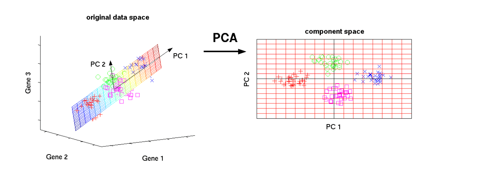

# 머신러닝 - 차원 축소 (Dimension Reduction)

> 매우 많은 피처로 구성된 다차원 데이터 세트의 차원을 축소해 새로운 차원의 데이터 세트를 생성하는 것
>
> 단순히 피처의 개수를 줄이기보다 이를 통해 데이터를 잘 설명할 수 있는 잠재적인 요소를 추출하는 데 큰 의미가 있음
>
> EX) 매우 많은 픽셀로 이루어진 이미지 데이터에서 잠재된 특성을 치러로 도출해 함축적 형태의 이미지 변환과 압축을 수행할 수 있는데, 이렇게 변환된 이미지는 원본 이미지보다 훨씬 적은 차원이기에 이미지 분류 시에 과적합 영향력이 작아져서 예측 성능을 올릴 수 있음
>
> EX)  문서 내 단어들의 구성 속 시맨틱(Semantic)의미나 토픽(Topic)을 잠재 요이소로 간주해 찾아낼 수 있음 (SVD와 NMF가 이러한 Semactic Topic 모델링을 위한 기반 알고리즘으로 사용됨)

* Feature Selection
  * 특정 피처에 종속성이 강한 불필요한 피처는 아예 제거하고, 데이터의 특징을 잘 나타내는 주요 피처만 선택하는 것
* Feature Extraction
  * 기존 피처를 저 차원의 중요 피처로 압축해서 추출하는 것, 새롭게 추출된 중요 특성은 기존의 피처가 압축된 것으로 기존 피처와는 완전히 다른 값
  * 단순 압축이 아닌, 함축적으로 더 잘 설명할 수 있는 또 다른 공간으로 매핑해 기존의 피처를 추출하는 것

---

### PCA (Principal Component Analysis)

> 가장 대표적인 차원 축소 기법으로 여러 변수 간에 존재하는 상관관계를 이용해 이를 대표하는 주성분(Principal Component)을 추출해 차원을 축소하는 기법
>
> Ex) 2차원 공간에 n개의 데이터들이 타원형으로 분포되어 있을 때, 이 데이터들의 분포 특성을 e1,e2 두 개의 벡터로 설명하는 것 -> e1, e2의 방향과 크기를 알아내어 데이터 분포의 형태를 설명

* 기존 데이터의 정보 유실이 최소화되기 위해서 PCA는 가장 높은 분산을 가지는 데이터의 축을 찾아 이 축으로 차원을 축소 -> 이것이 PCA의 주성분 (분산이 데이터의 특성을 가장 잘 나타내는 것으로 간주)

[이미지 출처]: https://ratsgo.github.io/from%20frequency%20to%20semantics/2017/04/06/pcasvdlsa/

* 원본 데이터의 피처 개수에 비해 매우 작은 주성분들로 원본 데이터의 총 변동성을 대부분 설명하는 분석법

* 입력 데이터의 공분산 행렬(Covariance Matrix)을 고유값 분해하고, 이렇게 구한 고유벡터에 입력 데이터를 선형 변환하는 것, 이 고유벡터가 PCA의 주성분 벡터로서 입력 데이터의 분산이 큰 방향을 나타내고, 고윳값(eigenvalue)은 이 고유벡터의 크기를 나타내면서 입력 데이터의 분산을 나타냄

  * 선형 변환 : 특정 벡터에 행렬 A를 곱해 새로운 벡터로 변환하는 것 = 특정 벡터를 하나의 공간에서 다른 공간으로 투영

  * 고유 벡터 : 행렬 A를 곱하더라도 방향이 변하지 않고 그 크기만 변하는 벡터 X로 정방 행렬은 최대 차원 수만큼의 고유벡터를 가질 수 있음
    Ex) Ax=ax (a=스칼라값) 일 때, x는 고유벡터
    고유벡터는 행렬이 작용하는 힘의 방향과 관계가 있어 행렬을 분해하는 데 사용됨

  * 공분산(Covariance) : 두 변수 간의 변동을 의미

    Ex) X=사람키, Y=몸무게 -> Cov(X,Y) > 0은 X(키)가 증가할 때 Y(몸무게)도 증가한다는 의미

  * 공분산 행렬 : 여러 변수와 관련된 공분산을 포함하는 정방형 행렬

    * 공분산 행렬은 정방 행렬 (Diagonal Matrix)이며 대칭행렬 (Symmetric Matrix)임 (즉 A^T = A)
    * 이 대칭행렬은 항상 고유벡터를 직교행렬(orthogonal matrix)로, 고유값을 정방 행렬로 대각화할 수 있다는 고유값 분해와 관련된 특성을 지니고 있음

  

  [이미지출처]: https://stats.stackexchange.com/questions/241449/matrix-and-regression-model

* PCA는 컴퓨터 비전(Computer Vision)분야에서 활발하게 적용되고 있으며 특히, 얼굴 인식에 경우에 Eigen-face라고 불리는 PCA 변환으로 원본 얼굴 이미지를 노이즈를 제거하도록 변환해 사용하는 경우가 많음

---

### LDA (Linear Discriminant Analysis)

> PCA와 유사하게 입력 데이터 세트를 저차원 공간에 투영해 차원을 축소하는 기법으로, 중요한 차이는 LDA는 지도학습의 분류(Classification)에서 사용하기 쉽도록 개별 클래스를 분별할 수 있는 기준을 최대한 유지하면서 차원을 축소 -> 입력 데이터의 결정 값 클래스를 최대한으로 분리할 수 있는 축을 찾음

* 특정 공간상에서 클래스 분리를 최대화하는 축을찾기 위해 클래스 간 분산(between-class scatter)와 클래스 내부 분산(within-class scatter)의 비율을 최대화 하는 방식으로 차원 축소
  * 클래스 간 분산은 최대한 크게, 클래스 내부의 분산은 최대한 작게 가져가는 방식
  * 클래스 간 분산과 클래스 내부 분산 행렬을 생성한 뒤, 이 행렬에 기반해 고유벡터를 구하고 입력 데이터를 투영

---

### SVD (Singular Value Decomposition)

> PCA의 경우 정방행렬만을 고유벡터로 분해했지만, SVD는 행과 열의 크기가 다른 행렬에도 적용이 가능

* PCA가 SVD기반의 알고리즘으로 구현 됐으나 PCA는 밀집 행렬(Dense Matrix)에 대한 변환만 가능하며 SVD는 희소 행렬(Sparse Matrix)에 대한 변환도 가능
* SVD는 컴퓨터 비전 영역에서 이미지 압축을 통한 패턴 인식과 신호 처리 분야에 사용되고, 텍스트의 토픽 모델링 기법인 LSA (Latent Semantic Analysis)의 기반 알고리즘임

---

### NMF (Non-Negative Matrix Factorization)

> Truncated SVD와 같이 낮은 랭크를 통한 행렬 근사(Low-Rank Approximation) 방식의 변형으로 원본 행렬 내의 모든 원소 값이 모두 양수(0 이상)라는 게 보장되면 좀 더 간단하게 두 개의 기반 양수 행렬로 분해될 수 있는 기법

* 이미지 압축을 통한 패턴 인식, 텍스트의 토픽 모델링 기법, 문서 유사도 및 클러스터링에 잘 사용됨
* 영화 추천과 같은 추천 영역에 활발하게 적용 됨

