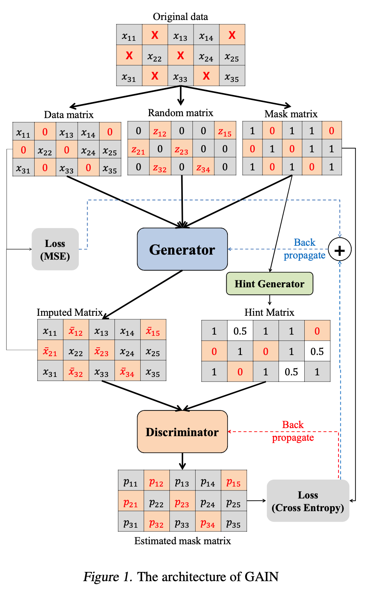

## GAIN: Missing Data Imputation using Generative Adversarial Nets

> Generative Adversarial Imputation Nets (GAIN)
>
> Paper : http://proceedings.mlr.press/v80/yoon18a/yoon18a.pdf
>
> Code : https://github.com/jsyoon0823/GAIN

Generative Adversarial Nets (GAN) 알고리즘을 이용하여 새롭게 고안한 MVI 방법으로  데이터가 없는 missing data 부분을 다시 생성하는 알고리즘

---

#### Missing data types

missing data 는 3가지 타입으로 분류될 수 있다.

1. missing completely at random (MCAR)
   * 정말 랜덤으로 나타나는 결측치 (어떤 변수와도 연관성이 없음)
2. missing at random (MAR)
   * 결측치가 오직 관찰된 데이터에만 의존하는 경우 (측정된 데이터와 연관이 있음)
3. not missing at random (NMAR)
   * 1 & 2 둘다 아닌 경우 (결측치가 측정 데이터 & 결측 데이터와 연관 있음)

본 논문에서는 데이터의 결측치가 MCAR 이라고 가정하고 이론적 결론을 추론한다.

---

#### Architecture

> 본 논문에서 제안하는 GAIN 은 크게 Generator(G), Discriminator(D), Hint Generator(H) 로 이루어져 있다.

1. Generator

