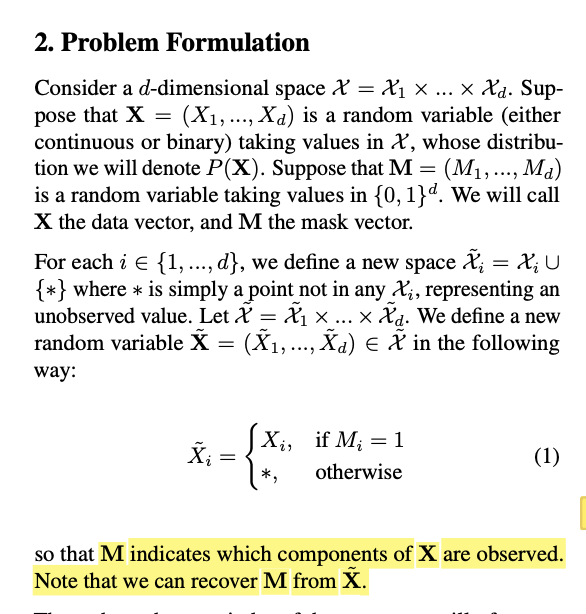
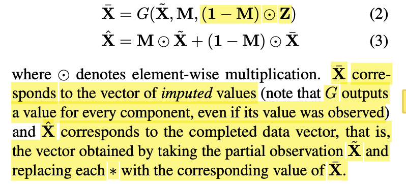
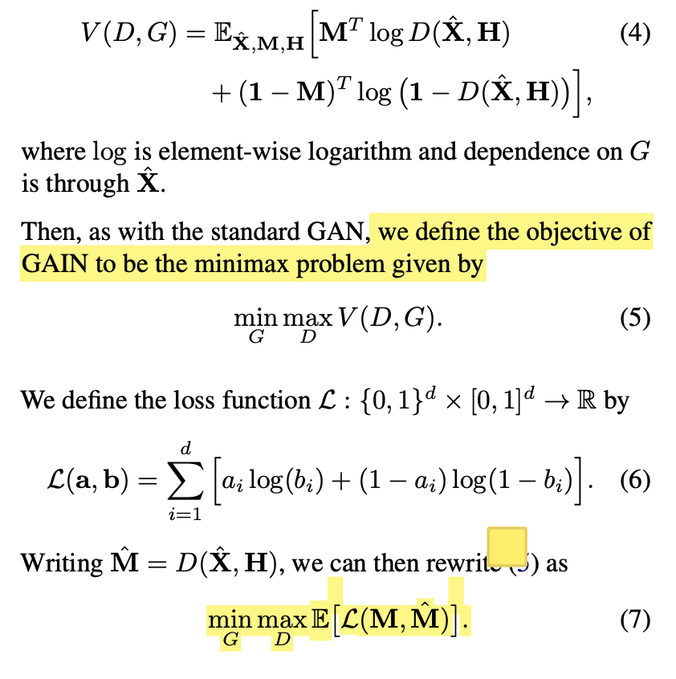

## GAIN: Missing Data Imputation using Generative Adversarial Nets

> Generative Adversarial Imputation Nets (GAIN)
>
> Paper : http://proceedings.mlr.press/v80/yoon18a/yoon18a.pdf
>
> Code : https://github.com/jsyoon0823/GAIN

Generative Adversarial Nets (GAN) 알고리즘을 이용하여 새롭게 고안한 MVI 방법으로  데이터가 없는 missing data 부분을 다시 생성하는 알고리즘

---

#### Missing data types

missing data 는 3가지 타입으로 분류될 수 있다.

1. missing completely at random (MCAR)
   * 정말 랜덤으로 나타나는 결측치 (어떤 변수와도 연관성이 없음)
2. missing at random (MAR)
   * 결측치가 오직 관찰된 데이터에만 의존하는 경우 (측정된 데이터와 연관이 있음)
3. not missing at random (NMAR)
   * 1 & 2 둘다 아닌 경우 (결측치가 측정 데이터 & 결측 데이터와 연관 있음)

본 논문에서는 데이터의 결측치가 MCAR 이라고 가정하고 이론적 결론을 추론한다.

---

#### Architecture

> 본 논문에서 제안하는 GAIN 은 크게 Generator(G), Discriminator(D), Hint Generator(H) 로 이루어져 있다.

위 그림과 같이 해당 논문에서 mask vector M을 사용하여 관측된 데이터와 그렇지 않은 데이터를 나타낸다.

1. **Generator (G)**

   * G는 실제 데이터 요소들을 보고 missing data를 impute 하여 관측 데이터와 imputed data를 결합한 총 데이터 벡터를 생성한다.
   * 원래의 데이터와 mask vector M과 noise variable Z를 input으로 하고, 이들을 이용해 새로운 데이터 matrix 를 output으로 추출한다.

   

   * 즉 위 식(2) 는 G로 부터 생성된 vector를 뜻하고 식(3)는 mask vector에 의해 최종적으로 결합된 vector를 뜻한다.

2. **Discriminatior (D)**

   * D는 G가 생성한 matrix를 이용해서 어떤 데이터가 실제로 관측된 것이고 어떤 것이 missing value 였는지를 판별한다.
   * Generator 로 부터 생성된 데이터가 전체적으로 real 이거나 fake 이던 기존 GAN과 다르게, 생성된 데이터가 부분적으로 fake 라는 점을 유의하여야 한다.
   * 즉, 전체 벡터가 아닌 어떤 요소(components)가 real 이고 fake 인지를 판별해야 한다. - 결국 mask vector M을 예측하는 것

3. **Hint (H)**

   * Discriminator 에 제시되는 추가적인 input으로 D의 분별 과정에 도움을 주는 역할을 한다.
   * H를 정의하는 방법에 따라 H에 담긴 M에 대한 정보의 양을 조절할 수 있다.

---

#### Objective

> D는 자신이 mask vector M을 예측하는 정확도를 최대화 하는 것을 목표하고, G는 D가 M을 예측하는 정확도를 최소화 하는 것을 목표로 한다

* 위 식(4) 에서 D(X,H) 는 Disciriminator의 결과로 1에 가까우면 해당 요소의 mask 가 1, 즉 실제 관찰된 데이터로 보고, 0에 가까우면 mask가 0, missing data로 본다.
* 즉, 식(5) V(D,G) 는 M=1 인 요소는 D(X,H) 가 1에 가까울 수록, M=0 인 요소는 1-D(X,H) 가 1에 가까울 수록 (D(X,H) 가 0에 가까울 수록) max가 되므로 D의 분별력이 늘어난다고 볼 수 있고, 반대로 될수록 G가 D의 분별력을 낮추고 있다고 볼 수 있다.
* 결과적으로 식(7) 처럼 원래의 M과 예측된 M 사이의 loss function 을 최대화 하는 D 최소화 하는 G를 찾으며 훈련시키는 것이다.

---

#### Conclusion

해당 논문에서는 다른 MVI 알고리즘 및 다양한 데이터와 비교하여 제시된 GAIN의 알고리즘이 상당히 좋은 성과를 낸다는 것을 결론지었다.