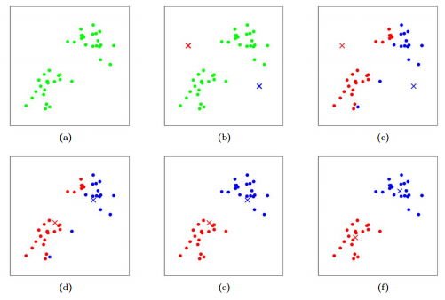
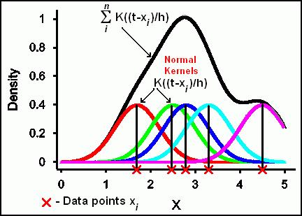

# 머신러닝 - 군집화 (Clustering)

>군집화는 데이터 내의 숨어 있는 별도의 그룹을  찾아서 의미를 부여하거나 동일한 분류 값에 속하더라도 그 안에서 더 세분화된 군집화를 추구하거나 서로 다른 분류 값의 데이터들을 더 넓은 영역으로 군집화하는 등의 면에서 분류(Classification)와 특성이 다름

---

### K-평균 (K-means clustering)

> Clustering에서 가장 일반적으로 사용되는 알고리즘으로, 군집 중심점(centroid)라는 특정한 임의의 지점을 선택해 해당 중심에 가장 가까운 점들을 선택하는 군집화 기법

* 알고리즘이 쉽고 간결하나 거리 기반 알고리즘으로 속성의 개수가 많을 경우 군집화 정확도가 떨어지므로 PCA로 차원 감소를 적용해야할 수 있음
* 반복 횟수가 많아질 경우 수행 시간이 매우 느려지고, 몇 개의 군집점을 선택해야 하는 지에 대한 가이드가 어려움
* 평균 거리 중심으로 이동하면서 군집화를 수행하므로 개별 군집 내의 데이터가 원형으로 흩어져 있는 경우에 매우 효과적 (데이터가 타원형으로 늘어선 경우에는 군집화를 잘 수행하지 못함)
* 군집화 개수 만큼의 임의의 중심점을 잡고 -> 각 중심점에 가까운 점들을  판단하고 -> 모아진 점들의 평균으로 각 중심점을 이동 시키고 -> 앞에서 한 과정들을 반복 -> 모아진 점들의 평균이 더이상 현재의 중심점과 다르지 않을 때 군집화 종료

---

### 평균 이동 (Mean Shift)

> K-평균과 유사하게 군집의 중심으로 지속적으로 움직면서 군집화를 수행하지만, 평균 이동은 중심을 데이터가 모여 있는 밀도가 가장 높은 곳으로 이동시키면서 군집화 작업을 수행

* 데이터의 분포도를 이용해 군집 중심점을 찾음, 이를 위해 확률 밀도 함수 (Probability Density Function)을 이용
  * 가장 데이터가 모여 있어 PDF 함수가 Peak인 지점을 군집 중심점으로 선정
  * 일반적으로 주어진 모델의 확률 밀도 함수를 찾기 위해서 KDE(Kernel Density Estimation)를 이용
* 특정 데이터를 반경 내의 데이터 분포 확률 밀도가 가장 높은 곳으로 이동하기 위해 주변 데이터와의 거리 값을 KDE 함수 값으로 입력한 뒤, 그 반환 값을 현재 위치에서 업데이트 하면서 이동하는 방식 -> 이러한 방식을 전체 데이터에 반복적으로 적용하면서 데이터의 군집 중심점을 찾아냄
* 해당 지점에서 각 신호들의 발산 세기의 합이 가장 큰 지점(Peak)을 중심점으로 취하는 방식
* KDE(Kernel Density Estimation) - 커널(Kernel) 함수를 통해 어떤 변수의 확률 밀도 함수를 추정하는 대표적인 방법, 관측된 데이터 각각에 커널 함수를 적용한 값을 모두 더한 뒤 데이터 건수로 나눠 확률 밀도 함수 추정 (대표적인 커널 함수로 가우시안 분포가 사용됨)

[이미지 출처]: https://genstat.kb.vsni.co.uk/knowledge-base/kernel-density-estimation/	"KDE"

* PDF(Probability Density Function : 확률 밀도 함수) - 확률 변수의 분포를 나타내는 함수로 특정 변수가 어떤 값을 갖게 될지에 대한 확률을 알게 되므로 이를 통해 변수의 특성 (평균, 분산 등), 확률 분포 등 변수의 많은 요소를 알 수 있음 (정규분포, 감마 분포, t-분포 등이 있음)
* 평균 이동 군집화는 대역폭(h)이 클수록 평활화된 KDE로 인해 적은 수의 군집 중심점을 가지고, 대역폭이 적을수록(뾰족한 형태의 KDE) 많은 수의 군집 중심점을 가짐
* 평균 이동 군집화는 군집의 개수를 미리 지정하지 않으며, 오직 대역폭의 크기에 따라 군집화를 수행
* 평균 이동은 데이터 세트의 형태를 특정 형태로 가정하던가, 특정 분포도 기반의 모델로 가정하지 않기 때문에 좀 더 유연한 군집화가 가능 하고 이상치의 영향력도 크지 않고, 미리 군집의 개수를 정할 필요가 없음, 하지만 알고리즘의 수행 시간이 오래 걸리고 bandwidth에 따른 군집화 영향이 매우 큼

---

### GMM (Gaussian Mixture Model)

> 군집화를 적용하고자 하는 데이터가 여러 개의 가우시안 분포 (Gaussian Distribution) 를 가진 데이터 집합들이 섞여서 생성된 것이라는 가정하에 군집화를 수행하는 것
>
> GMM은 확률 기반 군집화 이고 K-평균은 거리 기반 군집화

* 데이터가 여러 개의 가우시안 분포가 섞인 것으로 간주하고, 섞인 데이터 분포에서 이를 구성하는 여러 개의 정규 분포 곡선을 추출하고, 개별 데이터가 이 중 어떤 분포에 속하는지를 결정하는 방식 - 이와 같은 방식을 모수 추정이라고 함
* 모수 추정은 대표적으로 다음 2가지를 추정하는 것
  * 개별 정규 분포의 평균과 분산
  * 각 데이터가 어떤 정규 분포에 해당되는지의 확률
* 모수 추정을 위해 GMM은 EM(Expectation and Maximization)을 사용

---

### DBSCAN (Density Based Spatial Clustering of Applications with Noise)

> 특정 공간 내의 데이터 밀도 차이를 기반으로 알고리즘화 하여 복잡한 기하학적 분포도를 가진 데이터 세트에 대해서도 군집화를 잘 수행할 수 있음

* DBSCAN 을 구성하는 주요 파라미터
  * 입실론 주변 영역 (epsilon) - 개별 데이터를 중심으로 입실론 반경을 가지는 원형의 영역
  * 최소 데이터 개수 (min points) - 개별 데이터의 입실론 주변 영역에 포함되는 타 데이터의 개수
* 데이터 포인트 정의
  * 핵심 포인트 (Core Point) - 주변 영역 내에 최소 데이터 개수 이상의 타 데이터를 가지고 있는 데이터
  * 이웃 포인트 (Neighbor Point) - 주변 영역 내에 위치한 타 데이터
  * 경계 포인트 (Border Point) - 주변 영역 내에 최소 데이터 개수 이상의 이웃 포인트를 가지고 있지 않지만 핵심 포인트를 이웃 포인트로 가지고 있는 데이터
  * 잡음 포인트 (Noise Point) - 최소 데이터 개수 이상의 이웃 포인트를 가지고 있지 않으며, 핵심 포인트도 이웃 포인트로 가지고 있지 않는 데이터

* 

---

### 군집 평가 (Cluster Evaluation)

* 실루엣 분석 (Silhouette analysis)

  > 각 군집 간의 거리가 얼마나 효율적으로 분리돼 있는지를 나타내는 지표

  * 개별 데이터가 가지는 군집화 지표인 실루엣 계수(sillhouette coefficient) - 해당 데이터가 같은 군집 내의 데이터와 얼마나 가깝게 군집화돼 있고, 다른 군집에 있는 데이터와는 얼마나 멀리 분리돼 있는지를 나타내는 지표
    * 실루엣 계수는 -1에서 1사이의 값으로, 1로 가까워질수록 근처의 군집과 멀리 떨어져 있는 것을 뜻하고, 0으로 가까울수록 근처의 군집과 가깝다는 것을 뜻함 (음수는 아예 다른 군집에 데이터 포인트가 할당됨을 말함)
  * 좋은 군집화의 기준
    * 전체 실루엣 계수의 평군 값은 1에 가까울 수록 좋음
    * 개별 군집의 평균 값의 편차가 크지 않아야 함